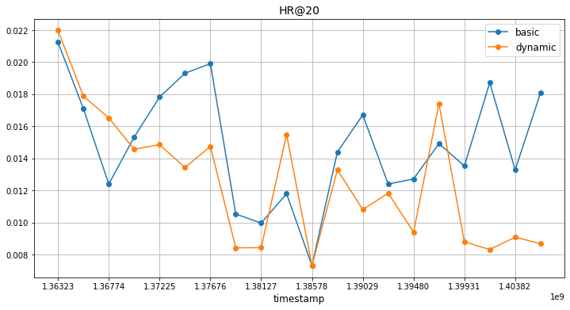
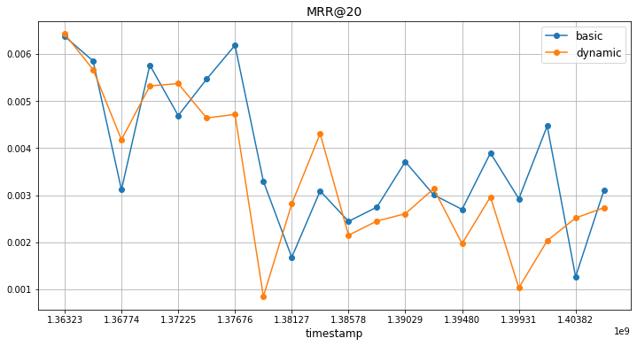
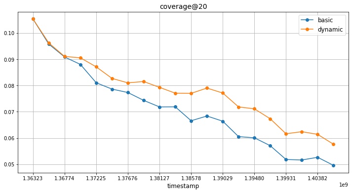
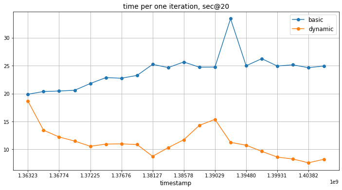

# Incremental learning for PureSVD with Continuous Space Expansion

Final project for "Intro to RecSys 2022" course at Skoltech

All experiments were performed on [Amazon Reviews Electronics](http://snap.stanford.edu/data/amazon/productGraph/categoryFiles/reviews_Electronics_5.json.gz) dataset.

To run the experiments with incremental learning for PureSVD with continuous space expansion and plot graphs run the following command:
```
python run_dynamic_svd_experiments.py
```

To run experiments with space expansion only, run the following script:
```
python run_svd_expansion_experiments.py
```

In a file `config.py` it is possible to change the parameters and variables necessary for the operation of the svd, space expansion, or the calculation of metrics and results


Team Members: Gleb Bazhenov, Dmitrii Gavrilev, Yaroslav Pudyakov, Saydash Miftakhov\
Skoltech 2022


         |  
:-------------------------:|:-------------------------:
  |  


